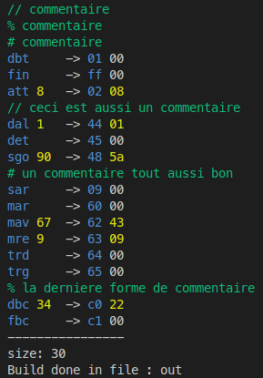

# Progmem, mais en Rust avec plus de fonctionnalitées
Ce programme peut compiler les programmes vers le bytecode défini par [le tp9 du cours de INF1900 de Polytechnique Montréal](https://cours.polymtl.ca/inf1900/tp/tp9/).

## Différence majeure avec Progmem du cours de INF1900
Contrairement à Progmem du cours de INF1900, l'instruction `det`

## Fonctionnalitées
- Multiplateforme Mac et Linux
- Fourni une sortie colorée
- Gère les erreurs
- Peut enlever du code inutile
- Peut décompiler du bytecode

## Instructions d'utilisation
./progmem [-s] [-d] [-c] [-o outputFile] inputFile

-s : rend le programme silencieux (facultatif)

-o : fichier de sortie (facultatif)

-d : option de décompilation d'un programme (facultatif)

-c : enlève du code inutile (facultatif, incompatible avec -d)

## Screenshots

